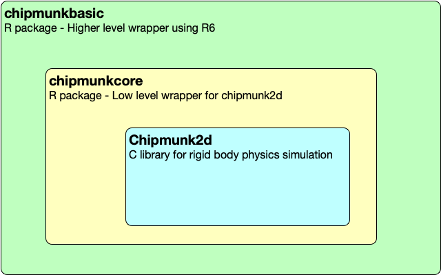
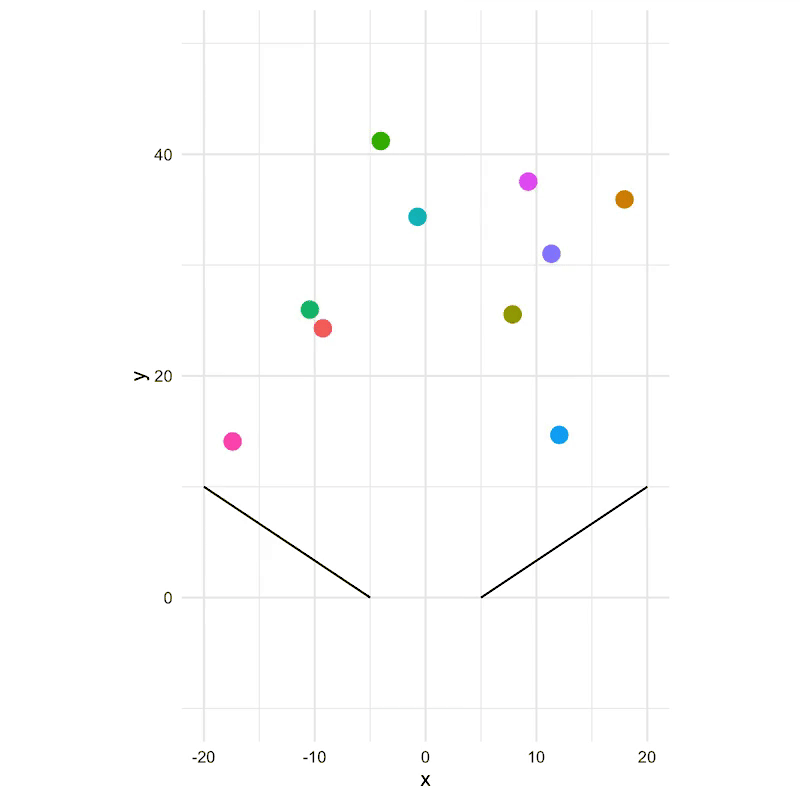

<!-- README.md is generated from README.Rmd. Please edit that file -->

```{r, include = FALSE}
knitr::opts_chunk$set(
  collapse = TRUE,
  comment = "#>",
  fig.path = "man/figures/README-",
  out.width = "100%"
)

if (FALSE) {
  pkgdown::build_site(override = list(destination = "../coolbutuseless.github.io/package/chipmunkbasic"))
}

library(chipmunkbasic)
```

# chipmunkbasic

<!-- badges: start -->

[](https://www.tidyverse.org/lifecycle/#experimental)
<!-- badges: end -->

`chipmunkbasic` is a wrapper around the [Chipmunk2d](http://chipmunk-physics.net/) rigid body 
physics simulation library.

`chipmunkbasic` is just the simulator. To actually render the positions of bodies in the simulation you'll need
to use [ggplot2](https://cran.r-project.org/package=ggplot2), [cairocore](https://github.com/coolbutuseless/cairocore) or
something else

**Read the online documentation [here](https://coolbutuseless.github.io/package/chipmunkbasic)**


## Chipmunk2d

* [Chipmunk2d](http://chipmunk-physics.net/) is a C library for simulating rigid
body physics
* [chipmunkcore](https://coolbutuseless.github.io/package/chipmunkcore) is a very low-level
wrapper around the C library, providing 1-to-1 mapping between R functions and 
the core C library
* [chipmunkbasic](https://coolbutuseless.github.io/package/chipmunkbasic) provides a 
nicer wrapper around `chipmunkcore`




## Pre-requisites

You'll need to install the [Chipmunk2d](http://chipmunk-physics.net/) library on 
your system.  See the README for [chipmunkcore](https://github.com/coolbutuseless/chipmunkcore)
for more information

    
## Installation

Install this package from [GitHub](https://github.com/coolbutuseless/chipmunkbasic) with:

``` r
# install.package('remotes')
remotes::install_github('coolbutuseless/chipmunkcore')
remotes::install_github('coolbutuseless/chipmunkbasic')
```


## Vignettes

* [Basic Circles](https://coolbutuseless.github.io/package/chipmunkbasic/articles/basic.html) shows how circles can be added to a scene
* [Basic Boxes](https://coolbutuseless.github.io/package/chipmunkbasic/articles/basic-boxes.html) shows how boxes can be added to a scene and rendered in ggplot
* [Galton board](https://coolbutuseless.github.io/package/chipmunkbasic/articles/galton.html)
* [Plop](https://coolbutuseless.github.io/package/chipmunkbasic/articles/plot.html) shows a large bowling ball being projected into a bucket of elastic circles
* [Plop (polygon)](https://coolbutuseless.github.io/package/chipmunkbasic/articles/plot-polygon.html) shows a large triangle (with initial angular velocity) being projected into a bucket of elastic circles
* [Inevitable Destruction](https://coolbutuseless.github.io/package/chipmunkbasic/articles/destruction.html) shows a bowling ball destroying a tower of blocks
* [Inevitable Destruction 2](https://coolbutuseless.github.io/package/chipmunkbasic/articles/destruction-two.html) more gratuitous destruction


## ToDo

* Add constraints and joints

## Galton Board

For full code, see the [vignette](https://coolbutuseless.github.io/package/chipmunkbasic/articles/galton.html)

Thanks to [Esteban Moro](https://twitter.com/estebanmoro) for fine-tuning this simulation, and contributing his changes.


##  A simple simulation


```{r eval = FALSE}
library(chipmunkbasic)
library(ggplot2)
set.seed(1)

#~~~~~~~~~~~~~~~~~~~~~~~~~~~~~~~~~~~~~~~~~~~~~~~~~~~~~~~~~~~~~~~~~~~~~~~~~~~~~
# Initialize a simulation space
#~~~~~~~~~~~~~~~~~~~~~~~~~~~~~~~~~~~~~~~~~~~~~~~~~~~~~~~~~~~~~~~~~~~~~~~~~~~~~
cm <- Chipmunk$new()

#~~~~~~~~~~~~~~~~~~~~~~~~~~~~~~~~~~~~~~~~~~~~~~~~~~~~~~~~~~~~~~~~~~~~~~~~~~~~~
# Add fixed segments
#~~~~~~~~~~~~~~~~~~~~~~~~~~~~~~~~~~~~~~~~~~~~~~~~~~~~~~~~~~~~~~~~~~~~~~~~~~~~~
cm$add_static_segment(-20, 10, -5, 0)
cm$add_static_segment( 20, 10,  5, 0)

#~~~~~~~~~~~~~~~~~~~~~~~~~~~~~~~~~~~~~~~~~~~~~~~~~~~~~~~~~~~~~~~~~~~~~~~~~~~~~
# Fetch all the segments. Use for plotting
#~~~~~~~~~~~~~~~~~~~~~~~~~~~~~~~~~~~~~~~~~~~~~~~~~~~~~~~~~~~~~~~~~~~~~~~~~~~~~
segments_df <- cm$get_static_segments()

#~~~~~~~~~~~~~~~~~~~~~~~~~~~~~~~~~~~~~~~~~~~~~~~~~~~~~~~~~~~~~~~~~~~~~~~~~~~~~
# Add some circles 
#~~~~~~~~~~~~~~~~~~~~~~~~~~~~~~~~~~~~~~~~~~~~~~~~~~~~~~~~~~~~~~~~~~~~~~~~~~~~~
for (i in 1:10) {
  cm$add_circle(
    x = runif(1, -20, 20), 
    y = runif(1,  10, 50),
    vx = 10 * rnorm(1),
    vy = 10 * rnorm(1)
  )
}

#~~~~~~~~~~~~~~~~~~~~~~~~~~~~~~~~~~~~~~~~~~~~~~~~~~~~~~~~~~~~~~~~~~~~~~~~~~~~~
# Get the current positions of the circles as a data.frame
#~~~~~~~~~~~~~~~~~~~~~~~~~~~~~~~~~~~~~~~~~~~~~~~~~~~~~~~~~~~~~~~~~~~~~~~~~~~~~
circles <- cm$get_circles()
circles


for (frame in 1:45) {
  #~~~~~~~~~~~~~~~~~~~~~~~~~~~~~~~~~~~~~~~~~~~~~~~~~~~~~~~~~~~~~~~~~~~~~~~~~~~
  # Advance the simulation
  #~~~~~~~~~~~~~~~~~~~~~~~~~~~~~~~~~~~~~~~~~~~~~~~~~~~~~~~~~~~~~~~~~~~~~~~~~~~
  cm$advance(5)
  
  #~~~~~~~~~~~~~~~~~~~~~~~~~~~~~~~~~~~~~~~~~~~~~~~~~~~~~~~~~~~~~~~~~~~~~~~~~~~
  # Get the circles in their new locations
  #~~~~~~~~~~~~~~~~~~~~~~~~~~~~~~~~~~~~~~~~~~~~~~~~~~~~~~~~~~~~~~~~~~~~~~~~~~~
  circles <- cm$get_circles()
  
  #~~~~~~~~~~~~~~~~~~~~~~~~~~~~~~~~~~~~~~~~~~~~~~~~~~~~~~~~~~~~~~~~~~~~~~~~~~~~~
  # Plot everything
  #~~~~~~~~~~~~~~~~~~~~~~~~~~~~~~~~~~~~~~~~~~~~~~~~~~~~~~~~~~~~~~~~~~~~~~~~~~~~~
  p <- ggplot(circles) + 
    geom_point(aes(x, y, colour = as.factor(idx)), size = 4, na.rm=TRUE) + 
    geom_segment(data = segments_df, aes(x = x1, y = y1, xend = x2, yend = y2)) + 
    coord_fixed() + 
    # theme_void() + 
    theme_minimal() + 
    xlim(-20, 20) + 
    ylim(-10, 50) + 
    theme(legend.position = 'none')
  
  ggsave(sprintf("man/figures/png/%04i.png", frame), p, width = 6, height = 6)
}
```





## Acknowledgements

* R Core for developing and maintaining the language.
* CRAN maintainers, for patiently shepherding packages onto CRAN and maintaining
  the repository
